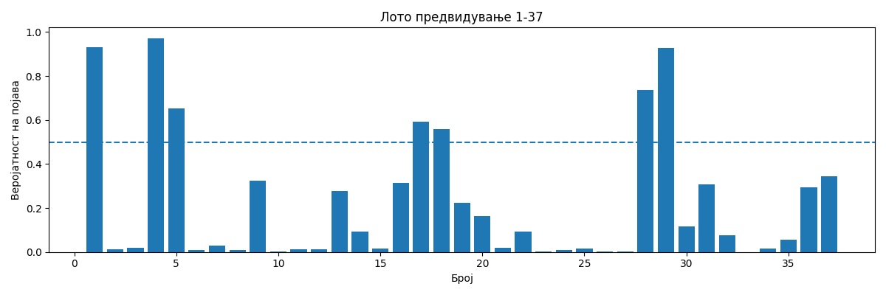

# Lottery ML Predictor (7/37)

Machine learning project for analyzing historical lottery draws
and predicting **relative probabilities** for each number using a
**multi-label classification model**.

>  Disclaimer: Lottery draws are random.  
> This project is for analytical purposes only.

---
## Approach

Each lottery draw is treated as a **multi-label outcome**  
(7 active labels out of 37 possible numbers).

The model:
- Uses **Logistic Regression (One-vs-Rest)**
- Predicts a probability for each number `1–37`
- Builds combinations from the highest-probability candidates
- The model can also evaluate user-defined combinations by computing
a confidence score based on learned probabilities.

---

##  Model Output Visualization

The chart below shows the relative probability assigned by the ML model
to each number (1–37) for the next draw.



---

##  Data Collection

Historical lottery draw data is collected using **web scraping**.

The dataset contains official draw results from **2022 to 2026**, which are
automatically extracted and parsed by a separate scraping script and stored
in `data.txt`.

Only validated draws with exactly **7 numbers per draw** are included in
the dataset before being used for training the machine learning model.

This ensures:
- Consistent input format
- Reproducible experiments
- Clear separation between data collection and ML modeling


## Project Structure

```text
play2win_lottogenerator/
│
├── data.txt             
├── requirements.txt
├── README.md
│
├── data.py              
├── features.py        
├── model.py           
├── predict.py           
└── plots.py            

